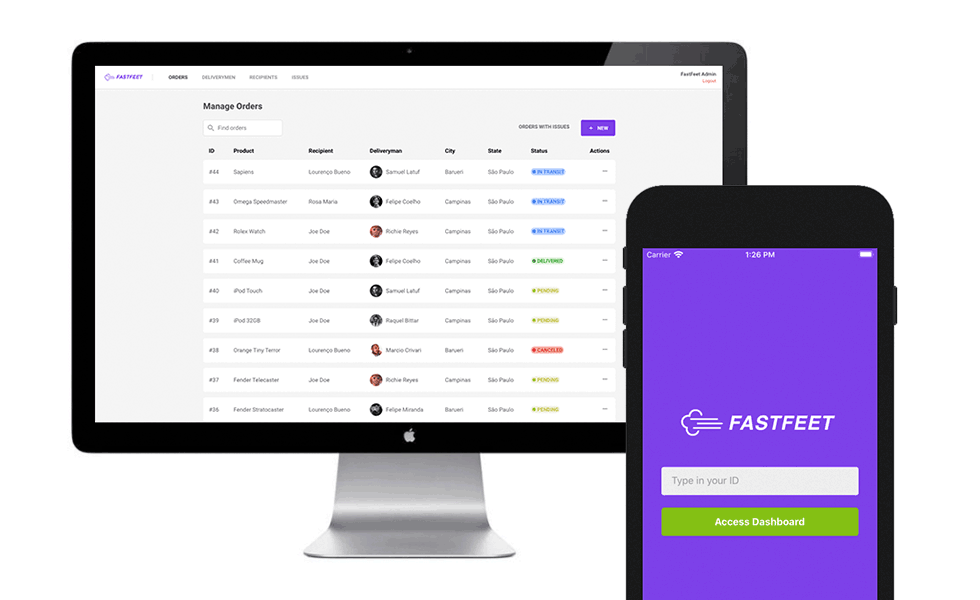

<h1 align="center">
  
</h1>

<h3 align="center">
  GoStack Final Challenge: FastFeet
</h3>



## Instructions

Clone the project
```
git clone --recursive https://github.com/lucasbittar/gostack-fastfeet.git
```
We're using a different clone approach because this repository contains submodules for each piece of the application (back-end, front-end and mobile)

Make sure you have the latest updates by running:
```
git submodule update --init --recursive
```

***

## Setup back-end
Change directory to the backend folder `cd backend` and run `yarn install`.

All of the following commands that has [] wrapped around it are related to the `.env` file. Just duplicate from `.env.example` and update the values.

- PostgreSQL
```
docker run --name database -e POSTGRES_PASSWORD=[DB_PASS] -p 5432:5432 -d [DB_USER]
```

- Redis
```
docker run --name redisfastfeet -p 6379:[REDIS_PORT] -d -t redis:alpine
```

- Seed database with admin user
```
yarn sequelize db:seed:all
```
This command generates the admin user with the following credentials:
```
Email: fastfeet@admin.com
Password: 123456
```

- Update the .env variables for Mailtrap and Sentry

At this point you shoud have the back-end all set up and good to go.

- Start server
```
yarn dev
```

- Start queue (open a new terminal)
```
yarn queue
```

## Setup front-end
Change directory to the front-end folder `cd frontend` and run `yarn install`.
Open `src/services/api.js` and update the `API_URL` variable with the `APP_URL` you specified in the config backend.

- Start server
```
yarn start
```

## Setup mobile
Change directory to the mobile folder `cd mobile` and run `yarn install`.
Open `src/services/api.js` and update the `API_URL` variable with the `APP_URL` you specified in the config backend.
The mobile app was tested on the iOS Simulator (iPhone X and iPhone 8), Genymotion (Google Pixel 3) and on an actual Android device (Moto X4).

- Build app for Android
```
npx react-native run-android
```

- Build app for iOS
```
npx react-native run-ios
```

- Start Metro server
```
yarn start
```

## Thanks
I'd like to thank Rocketseat for this [amazing code bootcamp](https://rocketseat.com.br/gostack)! I had a great time following the classes, working on the challenges, sending questions to the forum whenever I had one, helping the other students with their questions throught the forum and the Discord channel, proving to myself that I really understood and graspped the concept of something. You guys have shown me what a [great community](https://rocketseat.com.br/comunidade) is all about and I'm more than glad to say I'm part of it. Long live Rocketseat to the infinity and beyond!
